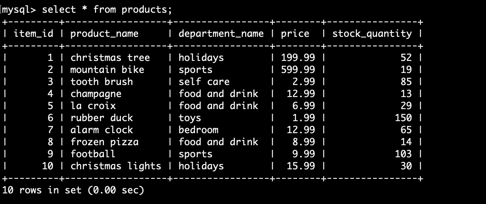

# Bamazon

In this activity, you'll be creating an Amazon-like storefront with the MySQL skills you learned this unit. The app will take in orders from customers and deplete stock from the store's inventory. 

When selecting all from products in the mysql command line, you will recieve a table with all the products availble. 

When running "node bamazonCustomer.js", the system will give you a list of the items, and ask you which item you would like to select. 

After you select an item, it will ask you how many you would like to purchase. 

If there if is enough inventory, bamazon will then tell you what item you selected, how many were in stock, how many you request, how many are left in stock after it deducts your count, the price per item and finally your total cost. 

If there is not enough inventory, bamazon will let you know what item you selected, how many are in stock, the number you requested, and that there is a insufficient quantity.

